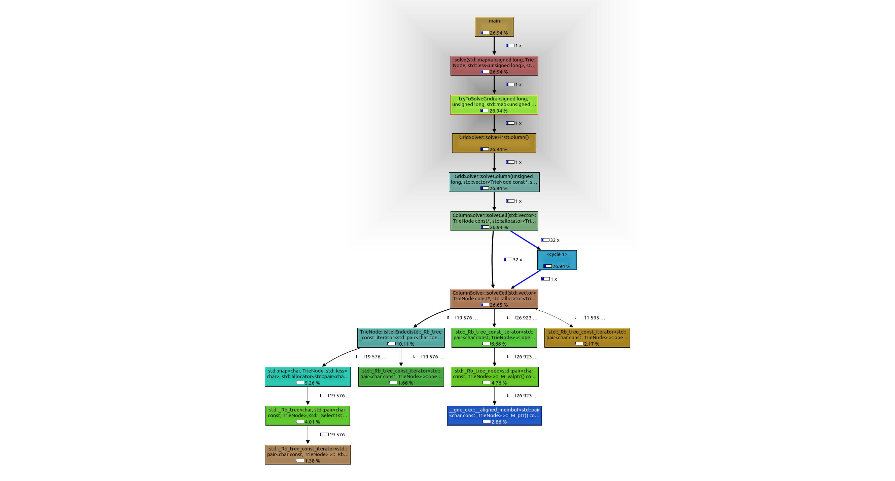

# Rectangle of words

## The problem statement

Given a dictionary of millions of words, write code to find the largest possible rectangle of letters such that every row forms a word (reading left to right) and every column forms a word (reading top to bottom).

## Assumptions

1. Read the inputs from a text file with a separate word on each line
2. Assume ASCII (or UTF-8) inputs
3. Size is assumed to be the number of cells in the grid of letters i.e. rows x columns
4. It is sufficient to return the first rectangle found as long as it has the largest possible size (not every rectangle of this size, as there could be a great many).

## Source data

The following repository has a text file containing nearly half a million words: <https://github.com/dwyl/english-words/>.

## Prototypes

### Scala prototype (v1)

See: [source code](https://github.com/AndrewTweddle/CodingExercises/blob/master/misc/WordRectangles/Scala_v1/src/main/scala/com/andrewtweddle/wordrects/WordRectMain.scala)

#### Initial performance results

I set this running (albeit in debug mode) on my personal machine on a Sunday evening. It produced the following outputs and performance data over a number of day:

```
  Grid size: 2025
    45 x 45
        0 solutions found
        Search duration: 5.7642 ms
  Grid size: 1395
    31 x 45
        0 solutions found
        Search duration: 0.0638 ms
  Grid size: 1305
    29 x 45
        0 solutions found
        Search duration: 0.0541 ms
  Grid size: 1260
    28 x 45
        0 solutions found
        Search duration: 0.1079 ms
  Grid size: 1215
    27 x 45
        0 solutions found
        Search duration: 0.0535 ms
  Grid size: 1170
    26 x 45
        0 solutions found
        Search duration: 0.0582 ms
  Grid size: 1125
    25 x 45
        0 solutions found
        Search duration: 0.069 ms
  Grid size: 1080
    24 x 45
        0 solutions found
        Search duration: 0.0661 ms
  Grid size: 1035
    23 x 45
        0 solutions found
        Search duration: 0.0851 ms
  Grid size: 990
    22 x 45
        0 solutions found
        Search duration: 0.0863 ms
  Grid size: 961
    31 x 31
        0 solutions found
        Search duration: 0.0777 ms
  Grid size: 945
    21 x 45
        0 solutions found
        Search duration: 5.5067 ms
  Grid size: 900
    20 x 45
        0 solutions found
        Search duration: 0.1146 ms
  Grid size: 899
    29 x 31
        0 solutions found
        Search duration: 0.0655 ms
  Grid size: 868
    28 x 31
        0 solutions found
        Search duration: 0.0576 ms
  Grid size: 855
    19 x 45
        0 solutions found
        Search duration: 0.153 ms
  Grid size: 841
    29 x 29
        0 solutions found
        Search duration: 0.0691 ms
  Grid size: 837
    27 x 31
        0 solutions found
        Search duration: 0.0508 ms
  Grid size: 812
    28 x 29
        0 solutions found
        Search duration: 0.0616 ms
  Grid size: 810
    18 x 45
        0 solutions found
        Search duration: 0.0804 ms
  Grid size: 806
    26 x 31
        0 solutions found
        Search duration: 0.0572 ms
  Grid size: 784
    28 x 28
        0 solutions found
        Search duration: 0.065 ms
  Grid size: 783
    27 x 29
        0 solutions found
        Search duration: 0.0337 ms
  Grid size: 775
    25 x 31
        0 solutions found
        Search duration: 0.0935 ms
  Grid size: 765
    17 x 45
        0 solutions found
        Search duration: 0.1052 ms
  Grid size: 756
    27 x 28
        0 solutions found
        Search duration: 0.0392 ms
  Grid size: 754
    26 x 29
        0 solutions found
        Search duration: 0.0398 ms
  Grid size: 744
    24 x 31
        0 solutions found
        Search duration: 0.0701 ms
  Grid size: 729
    27 x 27
        0 solutions found
        Search duration: 0.088 ms
  Grid size: 728
    26 x 28
        0 solutions found
        Search duration: 0.0543 ms
  Grid size: 725
    25 x 29
        0 solutions found
        Search duration: 0.0716 ms
  Grid size: 720
    16 x 45
        0 solutions found
        Search duration: 0.263 ms
  Grid size: 713
    23 x 31
        0 solutions found
        Search duration: 0.1132 ms
  Grid size: 702
    26 x 27
        0 solutions found
        Search duration: 0.0758 ms
  Grid size: 700
    25 x 28
        0 solutions found
        Search duration: 0.0536 ms
  Grid size: 696
    24 x 29
        0 solutions found
        Search duration: 0.0694 ms
  Grid size: 682
    22 x 31
        0 solutions found
        Search duration: 0.0817 ms
  Grid size: 676
    26 x 26
        0 solutions found
        Search duration: 0.0534 ms
  Grid size: 675
    25 x 27
        0 solutions found
        Search duration: 0.0585 ms
    15 x 45
        0 solutions found
        Search duration: 0.1186 ms
  Grid size: 672
    24 x 28
        0 solutions found
        Search duration: 0.05 ms
  Grid size: 667
    23 x 29
        0 solutions found
        Search duration: 0.0525 ms
  Grid size: 651
    21 x 31
        0 solutions found
        Search duration: 0.1212 ms
  Grid size: 650
    25 x 26
        0 solutions found
        Search duration: 0.0551 ms
  Grid size: 648
    24 x 27
        0 solutions found
        Search duration: 0.0688 ms
  Grid size: 644
    23 x 28
        0 solutions found
        Search duration: 0.1643 ms
  Grid size: 638
    22 x 29
        0 solutions found
        Search duration: 0.0814 ms
  Grid size: 630
    14 x 45
        0 solutions found
        Search duration: 0.1152 ms
  Grid size: 625
    25 x 25
        0 solutions found
        Search duration: 0.13 ms
  Grid size: 624
    24 x 26
        0 solutions found
        Search duration: 0.0682 ms
  Grid size: 621
    23 x 27
        0 solutions found
        Search duration: 0.0963 ms
  Grid size: 620
    20 x 31
        0 solutions found
        Search duration: 0.1344 ms
  Grid size: 616
    22 x 28
        0 solutions found
        Search duration: 0.1944 ms
  Grid size: 609
    21 x 29
        0 solutions found
        Search duration: 0.0952 ms
  Grid size: 600
    24 x 25
        0 solutions found
        Search duration: 0.0956 ms
  Grid size: 598
    23 x 26
        0 solutions found
        Search duration: 0.0728 ms
  Grid size: 594
    22 x 27
        0 solutions found
        Search duration: 0.1658 ms
  Grid size: 589
    19 x 31
        0 solutions found
        Search duration: 0.1338 ms
  Grid size: 588
    21 x 28
        0 solutions found
        Search duration: 0.1236 ms
  Grid size: 585
    13 x 45
        0 solutions found
        Search duration: 0.101 ms
  Grid size: 580
    20 x 29
        0 solutions found
        Search duration: 0.1645 ms
  Grid size: 576
    24 x 24
        0 solutions found
        Search duration: 0.1738 ms
  Grid size: 575
    23 x 25
        0 solutions found
        Search duration: 0.2153 ms
  Grid size: 572
    22 x 26
        0 solutions found
        Search duration: 0.0695 ms
  Grid size: 567
    21 x 27
        0 solutions found
        Search duration: 0.2377 ms
  Grid size: 560
    20 x 28
        0 solutions found
        Search duration: 0.1368 ms
  Grid size: 558
    18 x 31
        0 solutions found
        Search duration: 0.1374 ms
  Grid size: 552
    23 x 24
        0 solutions found
        Search duration: 0.2352 ms
  Grid size: 551
    19 x 29
        0 solutions found
        Search duration: 0.1942 ms
  Grid size: 550
    22 x 25
        0 solutions found
        Search duration: 0.1999 ms
  Grid size: 546
    21 x 26
        0 solutions found
        Search duration: 0.0674 ms
  Grid size: 540
    20 x 27
        0 solutions found
        Search duration: 0.1241 ms
    12 x 45
        0 solutions found
        Search duration: 0.1002 ms
  Grid size: 532
    19 x 28
        0 solutions found
        Search duration: 0.1391 ms
  Grid size: 529
    23 x 23
        0 solutions found
        Search duration: 0.2818 ms
  Grid size: 528
    22 x 24
        0 solutions found
        Search duration: 0.1659 ms
  Grid size: 527
    17 x 31
        0 solutions found
        Search duration: 0.0937 ms
  Grid size: 525
    21 x 25
        0 solutions found
        Search duration: 0.2277 ms
  Grid size: 522
    18 x 29
        0 solutions found
        Search duration: 0.2853 ms
  Grid size: 520
    20 x 26
        0 solutions found
        Search duration: 0.0338 ms
  Grid size: 513
    19 x 27
        0 solutions found
        Search duration: 0.0819 ms
  Grid size: 506
    22 x 23
        0 solutions found
        Search duration: 0.3192 ms
  Grid size: 504
    21 x 24
        0 solutions found
        Search duration: 0.2292 ms
    18 x 28
        0 solutions found
        Search duration: 0.0421 ms
  Grid size: 500
    20 x 25
        0 solutions found
        Search duration: 0.1818 ms
  Grid size: 496
    16 x 31
        0 solutions found
        Search duration: 0.0334 ms
  Grid size: 495
    11 x 45
        0 solutions found
        Search duration: 0.0334 ms
  Grid size: 494
    19 x 26
        0 solutions found
        Search duration: 0.0272 ms
  Grid size: 493
    17 x 29
        0 solutions found
        Search duration: 0.0578 ms
  Grid size: 486
    18 x 27
        0 solutions found
        Search duration: 0.0597 ms
  Grid size: 484
    22 x 22
        0 solutions found
        Search duration: 0.4234 ms
  Grid size: 483
    21 x 23
        0 solutions found
        Search duration: 0.4531 ms
  Grid size: 480
    20 x 24
        0 solutions found
        Search duration: 0.242 ms
  Grid size: 476
    17 x 28
        0 solutions found
        Search duration: 0.059 ms
  Grid size: 475
    19 x 25
        0 solutions found
        Search duration: 0.2533 ms
  Grid size: 468
    18 x 26
        0 solutions found
        Search duration: 0.0459 ms
  Grid size: 465
    15 x 31
        0 solutions found
        Search duration: 0.0912 ms
  Grid size: 464
    16 x 29
        0 solutions found
        Search duration: 0.0606 ms
  Grid size: 462
    21 x 22
        0 solutions found
        Search duration: 1.2071 ms
  Grid size: 460
    20 x 23
        0 solutions found
        Search duration: 0.7184 ms
  Grid size: 459
    17 x 27
        0 solutions found
        Search duration: 0.0802 ms
  Grid size: 456
    19 x 24
        0 solutions found
        Search duration: 0.29 ms
  Grid size: 450
    18 x 25
        0 solutions found
        Search duration: 0.1754 ms
    10 x 45
        0 solutions found
        Search duration: 0.046 ms
  Grid size: 448
    16 x 28
        0 solutions found
        Search duration: 0.0785 ms
  Grid size: 442
    17 x 26
        0 solutions found
        Search duration: 0.0384 ms
  Grid size: 441
    21 x 21
        0 solutions found
        Search duration: 1.353 ms
  Grid size: 440
    20 x 22
        0 solutions found
        Search duration: 0.809 ms
  Grid size: 437
    19 x 23
        0 solutions found
        Search duration: 0.491 ms
  Grid size: 435
    15 x 29
        0 solutions found
        Search duration: 0.0503 ms
  Grid size: 434
    14 x 31
        0 solutions found
        Search duration: 0.0416 ms
  Grid size: 432
    18 x 24
        0 solutions found
        Search duration: 0.164 ms
    16 x 27
        0 solutions found
        Search duration: 0.0673 ms
  Grid size: 425
    17 x 25
        0 solutions found
        Search duration: 0.1251 ms
  Grid size: 420
    20 x 21
        0 solutions found
        Search duration: 2.3548 ms
    15 x 28
        0 solutions found
        Search duration: 0.0623 ms
  Grid size: 418
    19 x 22
        0 solutions found
        Search duration: 1.227 ms
  Grid size: 416
    16 x 26
        0 solutions found
        Search duration: 0.0474 ms
  Grid size: 414
    18 x 23
        0 solutions found
        Search duration: 0.6185 ms
  Grid size: 408
    17 x 24
        0 solutions found
        Search duration: 0.2089 ms
  Grid size: 406
    14 x 29
        0 solutions found
        Search duration: 0.0484 ms
  Grid size: 405
    15 x 27
        0 solutions found
        Search duration: 0.0753 ms
    9 x 45
        0 solutions found
        Search duration: 0.0433 ms
  Grid size: 403
    13 x 31
        0 solutions found
        Search duration: 0.0411 ms
  Grid size: 400
    20 x 20
        0 solutions found
        Search duration: 6.3071 ms
    16 x 25
        0 solutions found
        Search duration: 0.1502 ms
  Grid size: 399
    19 x 21
        0 solutions found
        Search duration: 4.449 ms
  Grid size: 396
    18 x 22
        0 solutions found
        Search duration: 1.7939 ms
  Grid size: 392
    14 x 28
        0 solutions found
        Search duration: 0.0574 ms
  Grid size: 391
    17 x 23
        0 solutions found
        Search duration: 0.7974 ms
  Grid size: 390
    15 x 26
        0 solutions found
        Search duration: 0.0419 ms
  Grid size: 384
    16 x 24
        0 solutions found
        Search duration: 0.4411 ms
  Grid size: 380
    19 x 20
        0 solutions found
        Search duration: 12.1824 ms
  Grid size: 378
    18 x 21
        0 solutions found
        Search duration: 6.6699 ms
    14 x 27
        0 solutions found
        Search duration: 0.0825 ms
  Grid size: 377
    13 x 29
        0 solutions found
        Search duration: 0.0554 ms
  Grid size: 375
    15 x 25
        0 solutions found
        Search duration: 0.1364 ms
  Grid size: 374
    17 x 22
        0 solutions found
        Search duration: 2.2828 ms
  Grid size: 372
    12 x 31
        0 solutions found
        Search duration: 0.0512 ms
  Grid size: 368
    16 x 23
        0 solutions found
        Search duration: 1.002 ms
  Grid size: 364
    14 x 26
        0 solutions found
        Search duration: 0.0498 ms
    13 x 28
        0 solutions found
        Search duration: 0.0522 ms
  Grid size: 361
    19 x 19
        0 solutions found
        Search duration: 30.2883 ms
  Grid size: 360
    18 x 20
        0 solutions found
        Search duration: 12.1897 ms
    15 x 24
        0 solutions found
        Search duration: 0.2628 ms
    8 x 45
        0 solutions found
        Search duration: 0.0512 ms
  Grid size: 357
    17 x 21
        0 solutions found
        Search duration: 7.8525 ms
  Grid size: 352
    16 x 22
        0 solutions found
        Search duration: 2.7057 ms
  Grid size: 351
    13 x 27
        0 solutions found
        Search duration: 0.1444 ms
  Grid size: 350
    14 x 25
        0 solutions found
        Search duration: 0.2393 ms
  Grid size: 348
    12 x 29
        0 solutions found
        Search duration: 0.0586 ms
  Grid size: 345
    15 x 23
        0 solutions found
        Search duration: 1.8367 ms
  Grid size: 342
    18 x 19
        0 solutions found
        Search duration: 65.8529 ms
  Grid size: 341
    11 x 31
        0 solutions found
        Search duration: 0.0422 ms
  Grid size: 340
    17 x 20
        0 solutions found
        Search duration: 15.4413 ms
  Grid size: 338
    13 x 26
        0 solutions found
        Search duration: 0.0649 ms
  Grid size: 336
    16 x 21
        0 solutions found
        Search duration: 6.148 ms
    14 x 24
        0 solutions found
        Search duration: 0.2237 ms
    12 x 28
        0 solutions found
        Search duration: 0.043 ms
  Grid size: 330
    15 x 22
        0 solutions found
        Search duration: 1.7979 ms
  Grid size: 325
    13 x 25
        0 solutions found
        Search duration: 0.1593 ms
  Grid size: 324
    18 x 18
        0 solutions found
        Search duration: 86.4465 ms
    12 x 27
        0 solutions found
        Search duration: 0.0624 ms
  Grid size: 323
    17 x 19
        0 solutions found
        Search duration: 23.4016 ms
  Grid size: 322
    14 x 23
        0 solutions found
        Search duration: 0.5013 ms
  Grid size: 320
    16 x 20
        0 solutions found
        Search duration: 10.5686 ms
  Grid size: 319
    11 x 29
        0 solutions found
        Search duration: 0.0558 ms
  Grid size: 315
    15 x 21
        0 solutions found
        Search duration: 3.9836 ms
    7 x 45
        0 solutions found
        Search duration: 0.0344 ms
  Grid size: 312
    13 x 24
        0 solutions found
        Search duration: 0.1595 ms
    12 x 26
        0 solutions found
        Search duration: 0.0184 ms
  Grid size: 310
    10 x 31
        0 solutions found
        Search duration: 0.018 ms
  Grid size: 308
    14 x 22
        0 solutions found
        Search duration: 1.3471 ms
    11 x 28
        0 solutions found
        Search duration: 0.0269 ms
  Grid size: 306
    17 x 18
        0 solutions found
        Search duration: 101.8316 ms
  Grid size: 304
    16 x 19
        0 solutions found
        Search duration: 36.3563 ms
  Grid size: 300
    15 x 20
        0 solutions found
        Search duration: 13.2844 ms
    12 x 25
        0 solutions found
        Search duration: 0.0876 ms
  Grid size: 299
    13 x 23
        0 solutions found
        Search duration: 0.5137 ms
  Grid size: 297
    11 x 27
        0 solutions found
        Search duration: 0.0394 ms
  Grid size: 294
    14 x 21
        0 solutions found
        Search duration: 5.5568 ms
  Grid size: 290
    10 x 29
        0 solutions found
        Search duration: 0.0273 ms
  Grid size: 289
    17 x 17
        0 solutions found
        Search duration: 278.9511 ms
  Grid size: 288
    16 x 18
        0 solutions found
        Search duration: 106.783 ms
    12 x 24
        0 solutions found
        Search duration: 0.1392 ms
  Grid size: 286
    13 x 22
        0 solutions found
        Search duration: 1.5308 ms
    11 x 26
        0 solutions found
        Search duration: 0.0205 ms
  Grid size: 285
    15 x 19
        0 solutions found
        Search duration: 40.348 ms
  Grid size: 280
    14 x 20
        0 solutions found
        Search duration: 17.5097 ms
    10 x 28
        0 solutions found
        Search duration: 0.0389 ms
  Grid size: 279
    9 x 31
        0 solutions found
        Search duration: 0.0543 ms
  Grid size: 276
    12 x 23
        0 solutions found
        Search duration: 0.6001 ms
  Grid size: 275
    11 x 25
        0 solutions found
        Search duration: 0.1034 ms
  Grid size: 273
    13 x 21
        0 solutions found
        Search duration: 7.9787 ms
  Grid size: 272
    16 x 17
        0 solutions found
        Search duration: 352.6241 ms
  Grid size: 270
    15 x 18
        0 solutions found
        Search duration: 126.1968 ms
    10 x 27
        0 solutions found
        Search duration: 0.049 ms
    6 x 45
        0 solutions found
        Search duration: 0.0238 ms
  Grid size: 266
    14 x 19
        0 solutions found
        Search duration: 60.6675 ms
  Grid size: 264
    12 x 22
        0 solutions found
        Search duration: 2.0563 ms
    11 x 24
        0 solutions found
        Search duration: 0.1444 ms
  Grid size: 261
    9 x 29
        0 solutions found
        Search duration: 0.0436 ms
  Grid size: 260
    13 x 20
        0 solutions found
        Search duration: 26.0717 ms
    10 x 26
        0 solutions found
        Search duration: 0.1251 ms
  Grid size: 256
    16 x 16
        0 solutions found
        Search duration: 926.9376 ms
  Grid size: 255
    15 x 17
        0 solutions found
        Search duration: 436.4871 ms
  Grid size: 253
    11 x 23
        0 solutions found
        Search duration: 0.9853 ms
  Grid size: 252
    14 x 18
        0 solutions found
        Search duration: 209.7209 ms
    12 x 21
        0 solutions found
        Search duration: 11.7589 ms
    9 x 28
        0 solutions found
        Search duration: 0.0536 ms
  Grid size: 250
    10 x 25
        0 solutions found
        Search duration: 0.1482 ms
  Grid size: 248
    8 x 31
        0 solutions found
        Search duration: 0.0291 ms
  Grid size: 247
    13 x 19
        0 solutions found
        Search duration: 88.5093 ms
  Grid size: 243
    9 x 27
        0 solutions found
        Search duration: 0.0439 ms
  Grid size: 242
    11 x 22
        0 solutions found
        Search duration: 2.7628 ms
  Grid size: 240
    15 x 16
        0 solutions found
        Search duration: 1294.6474 ms
    12 x 20
        0 solutions found
        Search duration: 30.3518 ms
    10 x 24
        0 solutions found
        Search duration: 0.1786 ms
  Grid size: 238
    14 x 17
        0 solutions found
        Search duration: 742.8012 ms
  Grid size: 234
    13 x 18
        0 solutions found
        Search duration: 328.8117 ms
    9 x 26
        0 solutions found
        Search duration: 0.0397 ms
  Grid size: 232
    8 x 29
        0 solutions found
        Search duration: 0.0268 ms
  Grid size: 231
    11 x 21
        0 solutions found
        Search duration: 14.1584 ms
  Grid size: 230
    10 x 23
        0 solutions found
        Search duration: 1.1362 ms
  Grid size: 228
    12 x 19
        0 solutions found
        Search duration: 120.5323 ms
  Grid size: 225
    15 x 15
        0 solutions found
        Search duration: 3308.6498 ms
    9 x 25
        0 solutions found
        Search duration: 0.1286 ms
    5 x 45
        0 solutions found
        Search duration: 0.0167 ms
  Grid size: 224
    14 x 16
        0 solutions found
        Search duration: 2722.2153 ms
    8 x 28
        0 solutions found
        Search duration: 0.0362 ms
  Grid size: 221
    13 x 17
        0 solutions found
        Search duration: 1549.4376 ms
  Grid size: 220
    11 x 20
        0 solutions found
        Search duration: 51.9109 ms
    10 x 22
        0 solutions found
        Search duration: 3.1859 ms
  Grid size: 217
    7 x 31
        0 solutions found
        Search duration: 0.0184 ms
  Grid size: 216
    12 x 18
        0 solutions found
        Search duration: 524.1356 ms
    9 x 24
        0 solutions found
        Search duration: 0.1913 ms
    8 x 27
        0 solutions found
        Search duration: 0.0765 ms
  Grid size: 210
    14 x 15
        0 solutions found
        Search duration: 9150.0007 ms
    10 x 21
        0 solutions found
        Search duration: 19.5069 ms
  Grid size: 209
    11 x 19
        0 solutions found
        Search duration: 244.8977 ms
  Grid size: 208
    13 x 16
        0 solutions found
        Search duration: 5787.5942 ms
    8 x 26
        0 solutions found
        Search duration: 0.0432 ms
  Grid size: 207
    9 x 23
        0 solutions found
        Search duration: 1.4991 ms
  Grid size: 204
    12 x 17
        0 solutions found
        Search duration: 2664.7822 ms
  Grid size: 203
    7 x 29
        0 solutions found
        Search duration: 0.0343 ms
  Grid size: 200
    10 x 20
        0 solutions found
        Search duration: 88.8997 ms
    8 x 25
        0 solutions found
        Search duration: 0.1445 ms
  Grid size: 198
    11 x 18
        0 solutions found
        Search duration: 1039.7278 ms
    9 x 22
        0 solutions found
        Search duration: 4.9791 ms
  Grid size: 196
    14 x 14
        0 solutions found
        Search duration: 22914.9084 ms
    7 x 28
        0 solutions found
        Search duration: 0.079 ms
  Grid size: 195
    13 x 15
        0 solutions found
        Search duration: 24184.7223 ms
  Grid size: 192
    12 x 16
        0 solutions found
        Search duration: 11992.1211 ms
    8 x 24
        0 solutions found
        Search duration: 0.3715 ms
  Grid size: 190
    10 x 19
        0 solutions found
        Search duration: 421.8523 ms
  Grid size: 189
    9 x 21
        0 solutions found
        Search duration: 31.1366 ms
    7 x 27
        0 solutions found
        Search duration: 0.108 ms
  Grid size: 187
    11 x 17
        0 solutions found
        Search duration: 6491.4727 ms
  Grid size: 186
    6 x 31
        0 solutions found
        Search duration: 0.0333 ms
  Grid size: 184
    8 x 23
        0 solutions found
        Search duration: 2.7703 ms
  Grid size: 182
    13 x 14
        0 solutions found
        Search duration: 84366.3187 ms
    7 x 26
        0 solutions found
        Search duration: 0.0507 ms
  Grid size: 180
    12 x 15
        0 solutions found
        Search duration: 46071.7762 ms
    10 x 18
        0 solutions found
        Search duration: 2185.6832 ms
    9 x 20
        0 solutions found
        Search duration: 165.4387 ms
    4 x 45
        0 solutions found
        Search duration: 0.0335 ms
  Grid size: 176
    11 x 16
        0 solutions found
        Search duration: 26881.8929 ms
    8 x 22
        0 solutions found
        Search duration: 8.7871 ms
  Grid size: 175
    7 x 25
        0 solutions found
        Search duration: 0.1736 ms
  Grid size: 174
    6 x 29
        0 solutions found
        Search duration: 0.0301 ms
  Grid size: 171
    9 x 19
        0 solutions found
        Search duration: 917.5608 ms
  Grid size: 170
    10 x 17
        0 solutions found
        Search duration: 15106.2064 ms
  Grid size: 169
    13 x 13
        0 solutions found
        Search duration: 173258.3421 ms
  Grid size: 168
    12 x 14
        0 solutions found
        Search duration: 189820.5792 ms
    8 x 21
        0 solutions found
        Search duration: 66.8372 ms
    7 x 24
        0 solutions found
        Search duration: 0.4173 ms
    6 x 28
        0 solutions found
        Search duration: 0.0528 ms
  Grid size: 165
    11 x 15
        0 solutions found
        Search duration: 123178.1678 ms
  Grid size: 162
    9 x 18
        0 solutions found
        Search duration: 4779.3221 ms
    6 x 27
        0 solutions found
        Search duration: 0.0875 ms
  Grid size: 161
    7 x 23
        0 solutions found
        Search duration: 4.7336 ms
  Grid size: 160
    10 x 16
        0 solutions found
        Search duration: 77642.6866 ms
    8 x 20
        0 solutions found
        Search duration: 363.1487 ms
  Grid size: 156
    12 x 13
        0 solutions found
        Search duration: 588166.0623 ms
    6 x 26
        0 solutions found
        Search duration: 0.0365 ms
  Grid size: 155
    5 x 31
        0 solutions found
        Search duration: 0.0174 ms
  Grid size: 154
    11 x 14
        0 solutions found
        Search duration: 448050.1655 ms
    7 x 22
        0 solutions found
        Search duration: 12.5186 ms
  Grid size: 153
    9 x 17
        0 solutions found
        Search duration: 34743.5574 ms
  Grid size: 152
    8 x 19
        0 solutions found
        Search duration: 2016.6651 ms
  Grid size: 150
    10 x 15
        0 solutions found
        Search duration: 332090.6597 ms
    6 x 25
        0 solutions found
        Search duration: 0.1731 ms
  Grid size: 147
    7 x 21
        0 solutions found
        Search duration: 105.5293 ms
  Grid size: 145
    5 x 29
        0 solutions found
        Search duration: 0.0746 ms
  Grid size: 144
    12 x 12
        0 solutions found
        Search duration: 1139924.1968 ms
    9 x 16
        0 solutions found
        Search duration: 210115.7265 ms
    8 x 18
        0 solutions found
        Search duration: 11718.0876 ms
    6 x 24
        0 solutions found
        Search duration: 0.6366 ms
  Grid size: 143
    11 x 13
        0 solutions found
        Search duration: 1546993.3556 ms
  Grid size: 140
    10 x 14
        0 solutions found
        Search duration: 1436542.4349 ms
    7 x 20
        0 solutions found
        Search duration: 512.55 ms
    5 x 28
        0 solutions found
        Search duration: 0.0359 ms
  Grid size: 138
    6 x 23
        0 solutions found
        Search duration: 4.7873 ms
  Grid size: 136
    8 x 17
        0 solutions found
        Search duration: 92845.4115 ms
  Grid size: 135
    9 x 15
        0 solutions found
        Search duration: 1025909.0856 ms
    5 x 27
        0 solutions found
        Search duration: 0.0618 ms
    3 x 45
        0 solutions found
        Search duration: 0.0159 ms
  Grid size: 133
    7 x 19
        0 solutions found
        Search duration: 3158.4045 ms
  Grid size: 132
    11 x 12
        0 solutions found
        Search duration: 4498844.3311 ms
    6 x 22
        0 solutions found
        Search duration: 15.0452 ms
  Grid size: 130
    10 x 13
        0 solutions found
        Search duration: 4506031.5702 ms
    5 x 26
        0 solutions found
        Search duration: 0.0394 ms
  Grid size: 128
    8 x 16
        0 solutions found
        Search duration: 595692.174 ms
  Grid size: 126
    9 x 14
        0 solutions found
        Search duration: 4133605.9939 ms
    7 x 18
        0 solutions found
        Search duration: 20101.0267 ms
    6 x 21
        0 solutions found
        Search duration: 131.369 ms
  Grid size: 125
    5 x 25
        0 solutions found
        Search duration: 0.1257 ms
  Grid size: 124
    4 x 31
        0 solutions found
        Search duration: 0.0154 ms
  Grid size: 121
    11 x 11
        0 solutions found
        Search duration: 7508587.5902 ms
  Grid size: 120
    10 x 12
        0 solutions found
        Search duration: 1.51009172591E7 ms
    8 x 15
        0 solutions found
        Search duration: 3303890.5098 ms
    6 x 20
        0 solutions found
        Search duration: 643.6327 ms
    5 x 24
        0 solutions found
        Search duration: 0.9573 ms
  Grid size: 119
    7 x 17
        0 solutions found
        Search duration: 162413.1178 ms
  Grid size: 117
    9 x 13
        0 solutions found
        Search duration: 1.4809728666E7 ms
  Grid size: 116
    4 x 29
        0 solutions found
        Search duration: 0.1552 ms
  Grid size: 115
    5 x 23
        0 solutions found
        Search duration: 5.8391 ms
  Grid size: 114
    6 x 19
        0 solutions found
        Search duration: 4628.1493 ms
  Grid size: 112
    8 x 14
        0 solutions found
        Search duration: 1.47369879019E7 ms
    7 x 16
        0 solutions found
        Search duration: 1102152.1003 ms
    4 x 28
        0 solutions found
        Search duration: 0.0678 ms
  Grid size: 110
    10 x 11
        0 solutions found
        Search duration: 3.89855128006E7 ms
    5 x 22
        0 solutions found
        Search duration: 16.4376 ms
  Grid size: 108
    9 x 12
        0 solutions found
        Search duration: 5.13873240831E7 ms
    6 x 18
        0 solutions found
        Search duration: 22531.2465 ms
    4 x 27
        0 solutions found
        Search duration: 0.3234 ms
  Grid size: 105
    7 x 15
        0 solutions found
        Search duration: 6032189.8484 ms
    5 x 21
        0 solutions found
        Search duration: 126.1295 ms
  Grid size: 104
    8 x 13
        0 solutions found
        Search duration: 4.83791172846E7 ms
    4 x 26
        0 solutions found
        Search duration: 2.7044 ms
  Grid size: 102
    6 x 17
        0 solutions found
        Search duration: 254869.9316 ms
  Grid size: 100
    10 x 10
```

It ran for most of a day on the 10x10 grid size before the program was terminated.

#### Performance improvement opportunities

I chose to have fewer rows than columns for aesthetic reasons, so that solutions will fit on screen better. But later, when testing the C++ prototype, I found that performance is much better when row count > column count.

A better solution would be to build up the solution one row at a time, instead of one column at a time. It might also make it easier to track and report on strings found, instead of having a grid of characters.

But this is a prototype. It has served its purpose (for now). So I want to focus my effort on optimizing performance instead of cleaning up and improving this code.

### C++ Prototype (v1)

See: [source code](https://github.com/AndrewTweddle/CodingExercises/blob/master/misc/WordRectangles/Cpp_v1/main.cpp)

#### Initial experiment

Due to the long running times of some of the Scala rectangles, I decided to try a C++ solution next to see what impact this had on performance.

The C++ prototype doesn't try all grid sizes. Instead I hard-coded the row and column dimensions before running the code. This allowed me to compare performance on rectangle dimensions where I knew how long the Scala code had taken.

The C++ prototype only reports the first solution found. Whereas the Scala code returns multiple solutions of a particular size.

However the C++ prototype also counts the number of words of each length, and tracks the number of words in each branch of the trie.

#### Testing

On a 4x4 grid, the C++ prototype produces the following output:

```
Reading words from input file (grouping by word length)...

Word counts by length:
======================
1: 27
2: 637
3: 4711
4: 11171
5: 22950
6: 39518
7: 52093
8: 61019
9: 61754
10: 54321
11: 46411
12: 37525
13: 27924
14: 19258
15: 12148
16: 7115
17: 3982
18: 2003
19: 1053
20: 506
21: 238
22: 102
23: 49
24: 18
25: 7
26: 2
27: 3
28: 2
29: 2
31: 1
45: 1

Duration: 1777 ms

Reading words into tries (by word length)...

Duration: 7828 ms
Total unique words: 466551

solving...
    4 x 4
        solution found:
            'mid
            mane
            iare
            dmod
        Search Duration: 0 ms

TOTAL DURATION: 9615 ms
```

I'm suspicious that the first solution found is not symmetric around the main diagonal. This could indicate a bug.

#### Performance

To my surprise the C++ code typically ran 2.5 to 3.5 times longer than the Scala code on rectangles of the same dimension.

For example, on a 14 x 14 grid, the Scala code took around 23 seconds...

```
  Grid size: 196
    14 x 14
        0 solutions found
        Search duration: 22914.9084 ms
```

But the C++ code took over 78 seconds...

```
solving...
    14 x 14
        0 solutions found
        Search duration: 78651 ms

TOTAL DURATION: 83159 ms
```

And on a 7 x 18 grid, the Scala algorithm took around 20 seconds...

```
    7 x 18
        0 solutions found
        Search duration: 20101.0267 ms
```

But the C++ algorithm took over 96 seconds, almost 5 times longer...

```
solving...
    7 x 18
        0 solutions found
        Search duration: 96206 ms
```

#### Performance profiling

Change the C++ code to use a 7 x 20 grid, since this grid runs in around 0.5 seconds for the Scala solution...

```
    7 x 20
        0 solutions found
        Search duration: 512.55 ms
```

The C++ prototype takes around 1.6 seconds for this rectangle (and under 6 seconds in total)...

```
solving...
    7 x 20
        0 solutions found
        Search duration: 1643 ms

TOTAL DURATION: 5849 ms
```

Then install valgrind tools...

```
$ sudo apt-get install valgrind
$ sudo apt-get install kcachegrind
```

Create a suitable directory to store the file generated by valgrind. Then profile the code:

```
valgrind --tool=callgrind /path/to/wordrect /path/to/english-words/words.txt
```

This produces the following output:

```
$ valgrind --tool=callgrind /path/to/wordrect /path/to/words.txt
==17455== Callgrind, a call-graph generating cache profiler
==17455== Copyright (C) 2002-2017, and GNU GPL'd, by Josef Weidendorfer et al.
==17455== Using Valgrind-3.13.0 and LibVEX; rerun with -h for copyright info

...<snip>...
Reading words from input file (grouping by word length)...

...<snip>...

Duration: 31803 ms

Reading words into tries (by word length)...

==17455== brk segment overflow in thread #1: can't grow to 0x4a3f000
==17455== (see section Limitations in user manual)
==17455== NOTE: further instances of this message will not be shown
Duration: 143091 ms
Total unique words: 466551

solving...
    7 x 20
        0 solutions found
        Search duration: 77279 ms

TOTAL DURATION: 252216 ms
==17455== 
==17455== Events    : Ir
==17455== Collected : 14140925492
==17455== 
==17455== I   refs:      14,140,925,492
```

It took 5 minutes to run this.

Then use kcachegrind to view the performance profile...

```
$ kcachegrind callgrind.out.17455 &
```

Or view a text summary using:

```
$ callgrind_annotate callgrind.out.17455
```

ColumnSolver::solveCell() is called nearly 2 million times.
TrieNode::isIterEnded() is called over 19.5 million times.

If we look at the call graph for GridSolver::tryToSolveGrid(), we see the contribution of the red-black tree which the map data structure uses...



My first aha moment was that the C++ solution uses a pair of iterators to find matching characters in the nodes of the row and column tries. This felt like a good idea at the time. But iterating through a red-black tree is probably quite expensive. By contrast the Scala code iterates through one TrieNode's sub-nodes, but looks up the characters in the other TrieNode's map. This might be much faster when there are few characters in common.

The second realization is that iterating through a pair of arrays or vectors of sub-nodes (ordered by character) would probably be quite efficient. The maps are useful for building up the tries. But they could be converted to a more streamlined trie structure once built.

### Scala prototype (v1)

See: [source code](https://github.com/AndrewTweddle/CodingExercises/blob/master/misc/WordRectangles/Scala_v2/src/main/scala/com/andrewtweddle/wordrects/WordRectMain.scala)

#### A change in data structure

Modifying the Scala code to support multiple container types was very simple (though it did place the restriction of using only mutable collection types...

```Scala
  trait AbstractTrieNode[
      TrieNodeType <: AbstractTrieNode[TrieNodeType, SubTrieContainerType],
      SubTrieContainerType <: mutable.Iterable[(Char, TrieNodeType)]] {
    val subTries: SubTrieContainerType
    def getChildren: Iterator[(Char, TrieNodeType)] = subTries.iterator
  }

  class MutableTrieNode extends AbstractTrieNode[MutableTrieNode, mutable.Map[Char, MutableTrieNode]] {
    override val subTries: mutable.Map[Char, MutableTrieNode] = mutable.Map()

    @tailrec
    final def addChars(chars: List[Char]): Unit = {
      chars match {
        case firstChar :: otherChars => {
          val subTrieNode = subTries.getOrElseUpdate(firstChar, new MutableTrieNode())
          subTrieNode.addChars(otherChars)
        }
        case _ =>  // duplicate
      }
    }
    def addString(word: String): Unit = addChars(word.toList)
    def getTrieForChar(ch: Char): Option[MutableTrieNode] = subTries.get(ch)
  }

  class TrieNode(src: MutableTrieNode) extends AbstractTrieNode[TrieNode, mutable.ArrayBuffer[(Char, TrieNode)]]{
    override val subTries = src.getChildren.map {
      case (ch: Char, mtn: MutableTrieNode) => (ch, new TrieNode(mtn))
    }.to(mutable.ArrayBuffer).sortInPlaceWith(_._1 <= _._1)
  }
```

This was relatively painless. The solution now uses pairs of iterators, similar to the C++ v1 prototype. However there were minor differences, since the Map type was not sorted by key and Scala's iterator combines moving to the next item and retrieving the next item into a single next() operation.

#### Improvements in performance from the change in data structure

Performance is about 3.5 times better. Previously the Scala solution took 512.55 ms. Now it took just under 144 ms...

```
  Grid size: 140
    10 x 14
        0 solutions found
        Search duration: 401632.6926 ms
    7 x 20
        0 solutions found
        Search duration: 143.9671 ms
    5 x 28
        0 solutions found
        Search duration: 0.1018 ms

```

This speed-up seems quite consistent. It's a decent improvement, but far less than I was hoping for.

#### Improvements in performance from a change in grid dimensions

Next I modified the Scala code to have grids that are narrow and long (many rows), rather than wide with few rows. With this change the 20 x 7 solution takes 11.7261 ms. This is over 12 times faster, or nearly 44 times faster than the Scala_v1 solution.

The difference seems much more pronounced with grids that took a very long time before. Here are some comparisons:

| Size    | Before             | After            | Faster by |
| ---     | ---                | ---              | ---       |
| 12 x 12 | 1139924.1968 ms    | 243177.603399 ms | 4.68 x    | 
| 10 x 12 | 1.51009172591E7 ms | 32.6239 ms       | 462879 x  |
| 9 x 13  | 1.4809728666E7 ms  | 32.4473 ms       | 456424 x  |
| 8 x 14  | 1.47369879019E7 ms | 25.7712 ms       | 571839 x  |
| 11 x 11 | 7508587.5902 ms    | 1585342.7799 ms  | 4.74 x    |
| 10 x 10 | 1.45866746327E7 ms | 1.83222798886E7 ms | 0.80 x  |

So it seems that there is less than a 5x speed-up on the square grids. Unfortunately these are already some of the slowest grids to solve. Worryingly, the 10 x 10 grid went from 4h03 to 5h04.

But there are phenomenal speed-ups of 400 000 to 600 000 on some of the non-square grids which were very slow to solve before.

In most cases this change has produced significant speed-ups. However, there are a few cases where it has made some grids slower to process. For example:

| Size    | Before    | After     | Slower by |
| ---     | ---       | ---       | ---       |
| 7 x 31  | 0.0184 ms | 0.0206 ms | 1.12 x    |
| 9 x 23  | 1.4991 ms | 4.9877 ms | 3.33 x    |
| 9 x 22  | 4.9791 ms | 7.1606 ms | 1.43 x    | 

So it's not always true that a narrow grid is faster than a wide grid.

#### What is responsible for the speed-ups from a change in grid dimension?

But why is a long narrow grid generally more efficient. Presumably this is because the shape of the algorithmic search tree is different, and impossible branches of this search tree can be pruned earlier. Why would this be the case? Presumably because the algorithm processes one column at a time. So if each column has more rows in it, then the algorithm is able to reach greater word positions more quickly.

This suggests that a more fruitful line of improvement is to consider other patterns of expanding by row or by column to control the shape of the search tree.

#### Brainstorming further improvement ideas

The data structures could be improved further. For example, each TrieNode could have a bit-set with one bit per ASCII or UTF-8 character (though this would make the algorithm harder to generalize to other encodings later). Taking a bitwise AND of the row trie's and column trie's bitsets would give the common letters. Instead of iterating through maps, the algorithm could iterate through the set bits and lookup the relevant sub-tries in a map.

However, the performance data suggests that optimizing the algorithm will be far more effective than optimizing data structures.

A disadvantage of the current scheme is that one column is filled at a time. If position (i,j) is impossible to fill because of the choice of letter at position (i,0), say, then the algorithm must back-track across all columns c < j, potentially trying many different combinations which all fail at position (i,j) or earlier, before it chooses a different letter at (i, 0). Position (i, j) is pruning the search tree too late.

To fix this, a specific pattern could be hard-coded. A promising pattern would be to expand down the main diagonal, filling part of a row and part of a column until reaching the next point on the main diagonal. This would more quickly reach positions (i, j) where i and j are each a few letters deep in their respective words. This might prune invalid branches of the search tree sooner.

But there might be more desirable approaches than this. These might estimate the probability of being able to prune entire branches of the search tree much quicker. For example, the algorithm might consider specific letter positions (i, j) and the count of letters in position i (for column words) and j (for row words). Perhaps the next expansion direction could be determined by the dot product of the vectors of counts by letter for the relevant row trie and column trie.

It would be quite nice if we could generalize the strategy for choosing the next expansion direction. By injecting different strategies into the algorithm, we could easily experiment with different strategies. Once a good strategy has been found (exploiting the flexibility of Scala), we could convert this specific strategy into C++ and go back to optimizing for performance.

I also have another approach in mind. This is to choose the starting point in the grid which is expected to prune the search tree fastest. Perhaps an approach could be used based on letter counts per position in all possible row and column words. There is a way of implementing this fairly cheaply. Once such a starting point (r, c) is determined for a particular grid size, the row and column tries can be built up by shifting row words by r characters and column words by c characters before inserting them in their respective tries. And, if solutions are found, the grid can be written out using modular arithmetic to shift the row and column words by r and c characters in the opposite direction.
